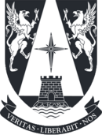

# Busqueda_Heuristica 
Repositorio creado para el **Curso de Técnica de Búsqueda y Heurísticas** en el programa de Magister en Inteligencia Artificial de la Universidad Adolfo Ibáñez.

Profesor: Jordi Pereira.

**Eduardo Carrasco Vidal**
 

## Documentos.

A. [Algoritmo de Búsqueda con `Ortools`.](https://github.com/educarrascov/MIA_BusqHeuristica/blob/main/1.7.%20Enunciado%20(SendMoreMoney)%20Colab.ipynb)
B. 
C. 
